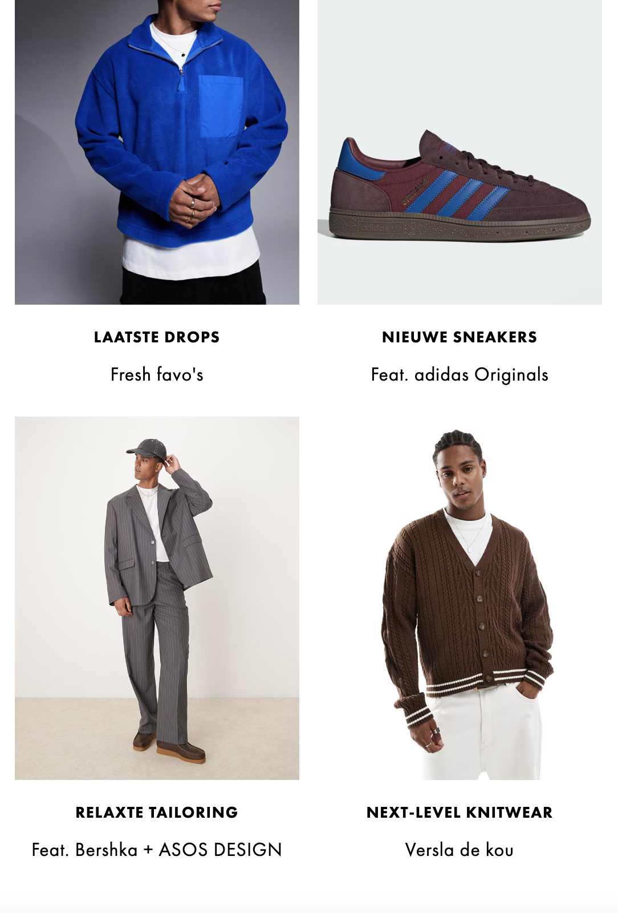

# Procesverslag
Markdown is een simpele manier om HTML te schrijven.
Markdown cheat cheet: [Hulp bij het schrijven van Markdown](https://github.com/adam-p/markdown-here/wiki/Markdown-Cheatsheet).

Nb. De standaardstructuur en de spartaanse opmaak van de README.md zijn helemaal prima. Het gaat om de inhoud van je procesverslag. Besteedt de tijd voor pracht en praal aan je website.

Nb. Door *open* toe te voegen aan een *details* element kun je deze standaard open zetten. Fijn om dat steeds voor de relevante stuk(ken) te doen.

## Jij

  
uitwerken voor kick-off werkgroep

  ### Auteur:
  Casper Hamers (vervangen door jouw naam)

  #### Je startniveau:
  Blauw (kies uit zwart, rood óf blauw)

  #### Je focus:
  Responsive (kies uit responsive óf surface plane)

## Je website

  
uitwerken voor kick-off werkgroep

  ### Je opdracht:
  Asos: https://www.asos.com/nl/heren/

  #### Screenshot(s) van de eerste pagina (small screen):
  Asos homepage: Asos: https://www.asos.com/nl/heren/

  
    
    
    
    
    

  #### Screenshot(s) van de tweede pagina (small screen):
  asos productscherm; https://www.asos.com/nl/asos-design/asos-design-oversized-recht-t-shirt-van-220g-m-zware-stof-met-straatprint-in-groen-met-wassing/prd/207329759
    
    
    

## Toegankelijkheidstest 1/2 (week 1)

ben begonnen met de screenreader test.
uit deze test is eigenlijk wel gebleken dat als ik nu blind zou zijn dat ik niet heel erg goed zou hebben begrepen wat er allemaal te bevinden is op deze site.

Ik ben begonnen met de links. Ik heb hier vooral geluisterd naar of ze ook wel vertelde wat de link was en waar het mij heen zou brengen.
Al snel ben ik erachter gekomen dat dat niet het geval is. Ze hebben niet eens gebruik gemaakt van alt teksten. Het enige wat de screenreader deed was vertellen wat er bij stond aan tekst. Dus als je een afbeelding van een witte broek had dan vertelde hij alleen de tekst die bij het plaatje stond en niet wat er op het plaatje stond.

Ik ging verder naar de koppen.
De koppen waren wel goed. de website begon netjes met kop 1, hierin werd wel gezegd waar ik was. Ik bevond mij op herenkleding online waardoor ik wist dat ik bij de mannen afdeling was. Daarna kop 2 hier waren een aantal van en die waren allemaal in de main en in de sections van de website. Uiteindelijk eindigde de site met kop 3. Kop 3 was te vinden in de footer.

De volgende stap was kijken naar formulierelementen.
Dit begon goed bovenaan in de navigatie balk. Eerst de zoekbalk en daarna een paar icoontjes vervolgens ging het door naar het menu met allerlei verschillende informatie erin. Het waren allemaal knoppen waar ik langs kwam. alles wat gebruikt werd als knop werd ook hardop genoemd. Dit vond ik wel goed.
alleen na de navigatie kwam er eigenlijk heel lang niks op de website en ging hij uiteindelijk door naar een carousel. Hier vertelde hij goed dat je met de eerste knop terug kon gaan en met de volgende knop verder kon gaan en uiteindelijk ook 4 preview knoppen.

uiteindelijk springt hij door naar de footer en daar zou je eventueel de taal kunnen veranderen.

Vervolgens ging ik naar orientatie punten van de website.
Het eerste orientatiepunt was de gehele navigatie balk bovenaan. dit is wel goed want dit is wel een orientatiepunt die belangrijk is en ook wel belangrijk is om als eerste te melden.

vervolgens ging hij naar een specifiek deel van de navigatie balk maar vergeet de andere helft van de navigatie balk. Zonde want nu mist een groot deel.
Daarna ging hij naar breadcrumbs. Maar die waren er helemaal niet, beetje raar dat dat dan wel verteld wordt.
Het volgende orientatiepunt is kopniveau 1. Begin van de website, goed. Legt ook weer uit waar we zijn binnen de website: "herenkleding online enn bevind mij op een hoofd in webmateriaal".
vervolgens ging hij eerst naar een regio binnen de site en daarna naar een flexibele banner. Dit deed hij een paar keer achter elkaar en kwam vervolgens bij het carousel van fotos en eindigt weer bij de footer.
opzich wel een duidelijk chronologische volgorde. Niet heel slecht van asos.

Vervolgens eindigde ik bij navigatie en woorden alleen daar had de site helemaal niks van dus dat bestond niet op de site.

Als tweede test doe ik de WCAG checklist.

OP PAPIER GEDAAN.

  
uitwerken na test in 2e werkgroep

  ### Bevindingen
  Lijst met je bevindingen die in de test naar voren kwamen:

## Breakdownschets (week 1)
Ben hier niet bij geweest, ben ingestroomd in week 4.

  
uitwerken na afloop 3e werkgroep

  ### de hele pagina:
  

  ### dynamisch deel (bijv menu):
  

  ### wellicht nog een dynamisch deel (bijv filter):
  

## Voortgang 1 (week 2)
ben hier dus ook helaas niet bij geweest.

  
uitwerken voor 1e voortgang

  ### Stand van zaken
  hier dit ging goed & dit was lastig (neem ook screenshots op van delen van je website en code)

  ### Agenda voor meeting
  samen met je groepje opstellen

  | Yasmine Uaali  | Sinem Uslu         |Noah Baggerman| Casper Hamers    |
  | ---            | ---                | ---          | ---              |
  |twee sections    | en dit             | en ik dit    | en dan ik dat    |
  |naast elkaar
  krijgen         | dit als er tijd is | nog een punt | dit wil ik zeker |
  | ...            | ...                | ...          | ...              |

  Yasmine had de volgende vraag: Hoe krijg ik twee secties naast elkaar.
  Sinem : Had dezelfde vraag als Yasmine en heeft ook nog de vraag, hoe zorg ik ervoor dat de image van een knop veranderd zodra ik erop klik.
  Casper: Is ook wel nieuwsgierig naar de twee secties vraag. En heeft ook nog de volgende vragen: Hoe maak ik een carousel (slideshow) van verschillende producten die wel mooi in een blok blijven.
  Hoe zorg ik ervoor dat ik een dropdown krijg die bepaalde informatie verbergt en die je dus alleen kan zien zodra je de dropdown aanklikt. Als laatste, hoe zorg je ervoor dat bepaalde aspecten van de website weg gaan naarmate je de website kleiner maakt en dus ook hoe komen ze weer terug als je de website weer groter maakt. Video werkt ook niet.

  ### Verslag van meeting
  hier na afloop snel de uitkomsten van de meeting vastleggen

  - punt 1
  - punt 2
  - nog een punt
  - ...

## Voortgang 2 (week 3)

  
uitwerken voor 2e voortgang

  ### Stand van zaken
  hier dit ging goed & dit was lastig (neem ook screenshots op van delen van je website en code)

  ### Agenda voor meeting
  samen met je groepje opstellen

  | student 1      | student 2          | student 3    | student 4        |
  | ---            | ---                | ---          | ---              |
  | dit bespreken  | en dit             | en ik dit    | en dan ik dat    |
  | en dat ook nog | dit als er tijd is | nog een punt | dit wil ik zeker |
  | ...            | ...                | ...          | ...              |

  ### Verslag van meeting
  hier na afloop snel de uitkomsten van de meeting vastleggen

  - punt 1
  - punt 2
  - nog een punt
- ...

## Toegankelijkheidstest 2/2 (week 4)

  
uitwerken na test in 9e werkgroep

  ### Bevindingen
  Lijst met je bevindingen die in de test naar voren kwamen (geef ook aan wat er verbeterd is):

## Voortgang 3 (week 4)

  
uitwerken voor 3e voortgang

  ### Stand van zaken
  hier dit ging goed & dit was lastig (neem ook screenshots op van delen van je website en code)

  ### Agenda voor meeting
  samen met je groepje opstellen

  | student 1      | student 2          | student 3    | student 4        |
  | ---            | ---                | ---          | ---              |
  | dit bespreken  | en dit             | en ik dit    | en dan ik dat    |
  | en dat ook nog | dit als er tijd is | nog een punt | dit wil ik zeker |
  | ...            | ...                | ...          | ...              |

  ### Verslag van meeting
  hier na afloop snel de uitkomsten van de meeting vastleggen

  - punt 1
  - punt 2
  - nog een punt
  - ...

## Eindgesprek (week 5)

  
uitwerken voor eindgesprek

  ### Je uitkomst - karakteristiek screenshots:
  

  ### Dit ging goed/Heb ik geleerd:
  Korte omschrijving met plaatjes

  

  ### Dit was lastig/Is niet gelukt:
  Korte omschrijving met plaatjes

  

## Bronnenlijst

  
continu bijhouden terwijl je werkt

  Nb. Wees specifiek ('css-tricks' als bron is bijv. niet specifiek genoeg).
  Nb. ChatGpT en andere AI horen er ook bij.
  Nb. Vermeld de bronnen ook in je code.

  1. bron 1
  2. bron 2
  3. ...

